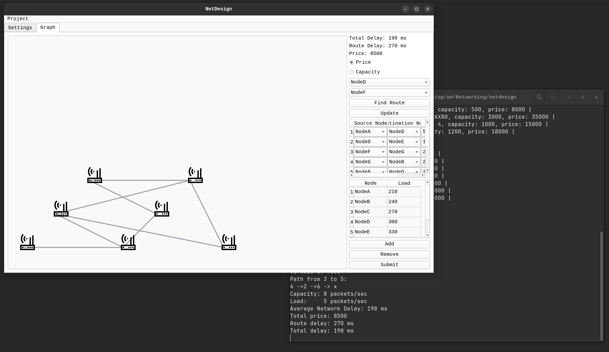

# netdesign
Simple computer network design tool witten in C++23 (Qt6)



## Dependencies

For Debian-based Linux distributions:

```console
sudo apt install g++ cmake make libboost-all-dev qt6-default
```

## Installation

Clone this repository:
```console
git clone https://github.com/alkuzin/netdesign
```

After dowloading do next:
```console
cd build && cmake CMakeLists.txt
```

To build project run this command:
```console
make all && cd ..
```

Run an application:
```console
./build/NetDesign
```